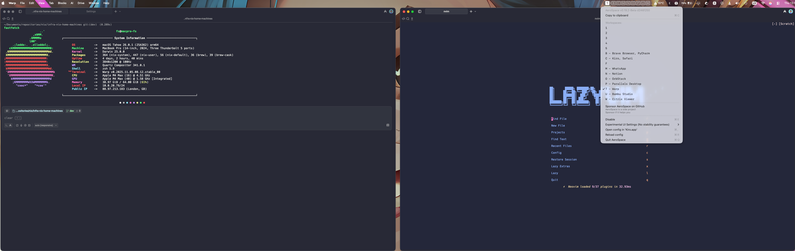

# NixOS and nix-darwin Configurations

A comprehensive, modular Nix configuration for managing multiple machines across NixOS and macOS platforms using [Nix Flakes](https://nixos.wiki/wiki/Flakes).

## Features

- 🔄 **Multi-platform support**: NixOS and macOS (via nix-darwin)
- 👤 **User-centric design**: Separates system and user configurations using Home Manager
- 📦 **Reproducible environments**: Uses Nix Flakes for deterministic builds
- 🧩 **Modular architecture**: Highly modular system with reusable components
- 🎨 **Theme consistency**: Global Catppuccin theme integration
- ⚡ **Hardware optimization**: Leverages nixos-hardware for device-specific optimizations
- 🔒 **Pre-commit hooks**: Automated code quality checks with alejandra formatter

## Showcase

<table>
<tr>
<td width="33%">

### Hyprland


</td>
<td width="33%">

### GNOME


</td>

</tr>
</table>

<table>
<tr>

<td width="33%">

### macOS


</td>
</tr>
</table>

## Quick Start

### Prerequisites

- Nix with flakes enabled
- Git

### Clone and Apply

```bash
# Clone the repository
git clone https://github.com/yourusername/nix-config.git
cd nix-config

# For NixOS
sudo nixos-rebuild switch --flake .#hostname

# For macOS
darwin-rebuild switch --flake .#hostname

# For Home Manager
home-manager switch --flake .#username@hostname
```

### Using Just Commands

This repository includes a `justfile` for common operations:

```bash
# Update and switch (macOS)
just quick-update

# Switch Darwin configuration
just darwin-switch

# Switch Home Manager configuration
just home-switch

# Update flake inputs
just update

# Clean old generations
just clean

# Format Nix files
just fmt

# Run pre-commit checks
just check-pre-commit
```

## Repository Structure

```
.
├── flake.nix              # Main flake configuration
├── flake.lock             # Lock file for reproducible builds
├── justfile               # Task runner commands
├── hosts/                 # System-level configurations
│   ├── {hostname}/        # Machine-specific configs
│   └── modules/           # Shared system modules
├── home/                  # User-level configurations
│   ├── {username}/        # User configs per machine
│   └── modules/           # Shared home modules
├── users/                 # User profile definitions
├── files/                 # Static config files and assets
├── overlays/              # Nix package overlays
└── docs/                  # Documentation
```

## Documentation

- 📚 **[Adding Machines Guide](docs/ADDING-MACHINES.md)** - Step-by-step guide for adding new machines
- 🔧 **[Manual Installations](docs/ManualInstalls.md)** - Software that requires manual setup
- 🎯 **[Improvements](docs/IMPROVEMENTS.md)** - Suggested improvements and enhancements
- ✅ **[Completed Improvements](docs/IMPROVEMENTS-COMPLETED.md)** - Recently implemented improvements
- 🪝 **[Pre-commit Hooks](docs/PRE-COMMIT.md)** - Pre-commit setup and usage
- 🏗️ **[Project Structure](docs/structure.md)** - Detailed structure documentation
- 🛠️ **[Technology Stack](docs/tech.md)** - Technologies and tools used
- 📖 **[Product Overview](docs/product.md)** - High-level product description

## Key Technologies

- **Nix Flakes**: Primary build system
- **Home Manager**: User-level package and configuration management
- **nix-darwin**: macOS system configuration
- **nixpkgs**: Main package repository (nixos-unstable)
- **Catppuccin**: Global theming system
- **Just**: Task runner for common operations

## Available Modules

### System Modules (`hosts/modules/`)

| Module | Description | Platform |
|--------|-------------|----------|
| `darwin-common.nix` | Shared macOS settings | macOS |
| `mac-common.nix` | macOS package imports | macOS |
| `nixos-common.nix` | Shared NixOS settings | NixOS |
| `corectrl.nix` | AMD GPU management | NixOS |
| `gnome.nix` | GNOME desktop | NixOS |
| `hyprland.nix` | Hyprland compositor | NixOS |
| `laptop.nix` | Laptop power management | NixOS |
| `ollama.nix` | Local AI models | NixOS |
| `steam.nix` | Gaming platform | NixOS |

### Home Manager Modules (`home/modules/`)

<details>
<summary><b>Terminal & Shell</b></summary>

- `alacritty.nix` - GPU-accelerated terminal
- `wezterm.nix` - Alternative terminal
- `atuin.nix` - Shell history sync
- `zsh.nix` - Zsh configuration
- `tmux.nix` - Terminal multiplexer
- `starship.nix` - Cross-shell prompt

</details>

<details>
<summary><b>Development Tools</b></summary>

- `git.nix` - Git with SSH signing
- `neovim.nix` - Neovim with LSP
- `lazygit.nix` - Terminal UI for Git
- `go.nix` - Go development
- `krew.nix` - kubectl plugins

</details>

<details>
<summary><b>System Utilities</b></summary>

- `bat.nix` - Better cat
- `btop.nix` - System monitor
- `bottom.nix` - Alternative monitor
- `fastfetch.nix` - System info
- `fzf.nix` - Fuzzy finder
- `scripts.nix` - Custom scripts

</details>

<details>
<summary><b>Desktop Environment</b></summary>

- `gnome.nix` - GNOME customizations
- `hyprland.nix` - Hyprland config
- `waybar.nix` - Wayland status bar
- `wofi.nix` - Application launcher
- `swaync.nix` - Notification center
- `darwin-aerospace.nix` - macOS tiling WM

</details>

<details>
<summary><b>Applications</b></summary>

- `easyeffects.nix` - Audio processing
- `flameshot.nix` - Screenshots
- `spicetify.nix` - Spotify customization
- `vscode.nix` - VS Code
- `zoom.nix` - Video conferencing

</details>

## Configuration Examples

### Adding a New Machine

See the [Adding Machines Guide](docs/ADDING-MACHINES.md) for detailed instructions.

### Importing Modules

```nix
# In your host configuration
{
  imports = [
    ../modules/darwin-common.nix
    ../modules/mac-common.nix
  ];
}

# In your home configuration
{
  imports = [
    ../modules/common.nix
    ../modules/neovim.nix
    ../modules/git.nix
  ];
}
```

## Updating

```bash
# Update all flake inputs
just update

# Or manually
nix flake update

# Then rebuild
just darwin-switch  # macOS
just home-switch    # Home Manager
```

## Maintenance

```bash
# Clean old generations (older than 7 days)
just clean

# Format Nix files
just fmt

# Run pre-commit checks
just run-hooks

# Verify flake
just verify-flake
```

## Automatic Garbage Collection

The configuration includes automatic garbage collection:
- **Frequency**: Weekly (Sunday)
- **Retention**: 30 days
- **Platform**: macOS (via darwin-common.nix)

## Contributing

Contributions are welcome! Please:

1. Fork the repository
2. Create a feature branch
3. Make your changes
4. Run `just fmt` to format code
5. Run `just check-pre-commit` to verify
6. Submit a pull request

## Troubleshooting

### Flake Check Fails

```bash
# Verify flake syntax
nix flake check

# Show detailed errors
nix flake check --show-trace
```

### Build Fails

```bash
# Clear build cache
nix-collect-garbage -d

# Rebuild with verbose output
nixos-rebuild switch --flake .#hostname --show-trace
```

### Pre-commit Issues

```bash
# Reinstall hooks
just install-hooks

# Run hooks manually
just run-hooks
```

## License

This repository is licensed under the MIT License. See [LICENSE](LICENSE) for details.

## Acknowledgments

- [NixOS](https://nixos.org/) - The Nix package manager and NixOS
- [Home Manager](https://github.com/nix-community/home-manager) - User environment management
- [nix-darwin](https://github.com/LnL7/nix-darwin) - macOS configuration
- [Catppuccin](https://github.com/catppuccin) - Soothing pastel theme
- [nixos-hardware](https://github.com/NixOS/nixos-hardware) - Hardware-specific configurations

---

**Note**: This is a personal configuration repository. Feel free to use it as inspiration, but you may need to adjust settings for your specific hardware and preferences.
